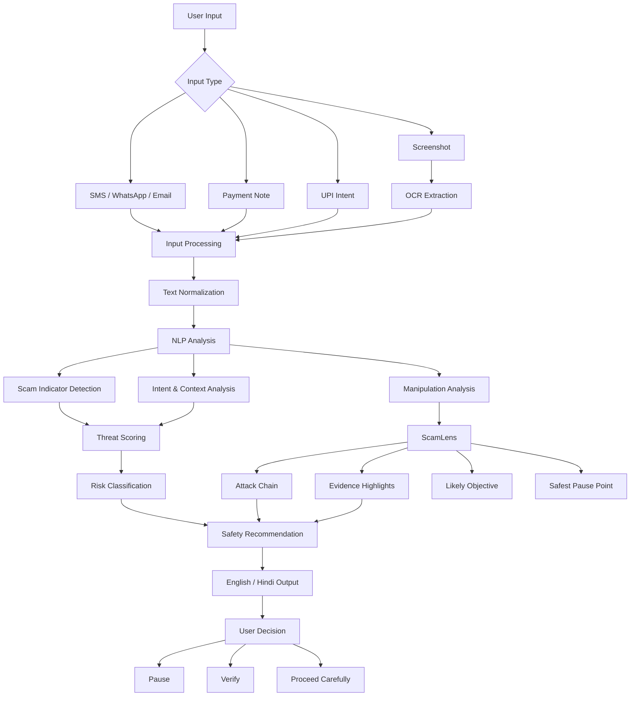
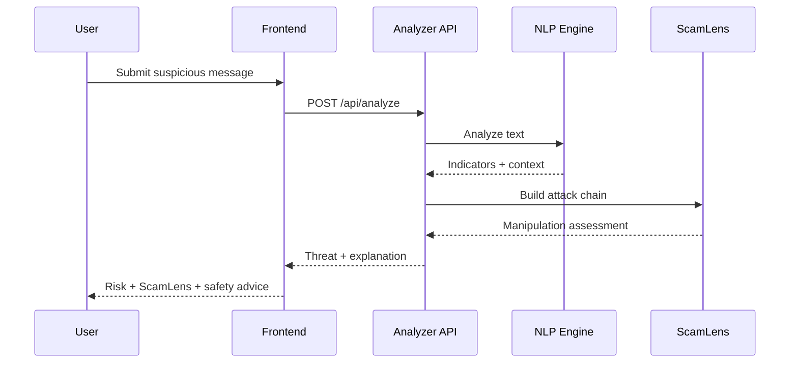

<div align="center">

# 🛡️ UPI-Shield

### AI-Powered Payment Scam & Social Engineering Detector

**Detect the manipulation. Understand the threat. Pause before you pay.**

[](https://upi-shield-phi.vercel.app/)
[](https://github.com/Deepakbuilds1)
[](#-license)
[](#-technology-stack)
[](#-security)

<br/>

**UPI-Shield** analyzes suspicious messages, payment requests and screenshots to identify
**urgency, authority abuse, fear, deception, payment pressure and other social-engineering signals.**

<br/>

[🚀 **Try Live Demo**](https://upi-shield-phi.vercel.app/) •
[📖 **Documentation**](#-documentation) •
[🧠 **ScamLens**](#-scamlens) •
[⚙️ **API**](#-api-documentation)

</div>

---

## 🚨 The Problem

Digital payment fraud is no longer only about hacking systems.

A major attack pattern is **social engineering**:

> The attacker convinces the victim to authorize the payment themselves.

A scammer may impersonate:

* 🏦 A bank employee
* 👮 Police or government officials
* ⚡ Electricity providers
* 📦 Delivery companies
* 💻 Customer support
* 💼 Employers or recruiters
* 💰 Investment platforms
* 🎁 Cashback/reward programs

The victim is manipulated using:

```text
AUTHORITY → FEAR → URGENCY → TRUST → PAYMENT
```

Traditional transaction checks may miss the most important part:

**the psychological manipulation happening before the transaction.**

---

# 💡 Our Solution

**UPI-Shield** is an AI-assisted security layer that analyzes the **language and context surrounding a payment request**.

Instead of simply saying:

> 🔴 HIGH RISK

UPI-Shield explains:

> **Why is this suspicious?**
> **How is the attacker manipulating the victim?**
> **What should the user do next?**

---

# ✨ Core Features

<table>
<tr>
<td width="50%">

### 🧠 AI Threat Analysis

Analyze suspicious:

* SMS
* WhatsApp messages
* Emails
* Payment notes
* UPI requests

</td>

<td width="50%">

### 🛡️ Threat Meter

Generate a **0–100 risk score** with:

* SAFE
* LOW
* MEDIUM
* HIGH
* CRITICAL

</td>
</tr>

<tr>
<td>

### 🔬 ScamLens

Understand the psychological attack chain:

`AUTHORITY → FEAR → URGENCY → PAYMENT`

</td>

<td>

### 📷 Screenshot Analysis

Upload a screenshot and extract suspicious text using OCR before analysis.

</td>
</tr>

<tr>
<td>

### 🇮🇳 Bilingual Protection

Safety explanations in:

* English
* Hindi

</td>

<td>

### 🔗 UPI Intent Analysis

Analyze UPI payment intent strings and identify suspicious payment context.

</td>
</tr>

<tr>
<td>

### 🧪 Benchmark Tests

Built-in scam scenarios for:

* Hackathon demos
* Regression testing
* Model evaluation

</td>

<td>

### 🚑 Safety Guidance

Provides actionable recommendations instead of only displaying a risk score.

</td>
</tr>
</table>

---

# 🧠 ScamLens

## See how the scam works before you pay.

ScamLens is the signature explainability feature of UPI-Shield.

Instead of treating AI detection as a black box, ScamLens breaks the message into **manipulation stages**.

### Example

**Suspicious message:**

```text
Your electricity connection will be disconnected
within 30 minutes.

Pay ₹2 immediately for verification.

Do not contact customer care.
```

UPI-Shield can identify:

```text
┌───────────────┐
│   AUTHORITY   │
│ "Electricity" │
└───────┬───────┘
        ↓
┌───────────────┐
│     FEAR      │
│ "Disconnected"│
└───────┬───────┘
        ↓
┌───────────────┐
│    URGENCY    │
│ "30 minutes"  │
└───────┬───────┘
        ↓
┌───────────────┐
│   ISOLATION   │
│ "Don't call"  │
└───────┬───────┘
        ↓
┌───────────────┐
│    PAYMENT    │
│     ₹2        │
└───────────────┘
```

### ScamLens Output

| Stage            | Evidence                    | Explanation                       |
| ---------------- | --------------------------- | --------------------------------- |
| AUTHORITY        | Electricity connection      | Creates institutional credibility |
| FEAR             | Disconnection threat        | Creates fear of consequences      |
| URGENCY          | 30 minutes                  | Prevents careful verification     |
| ISOLATION        | Don't contact customer care | Prevents independent verification |
| PAYMENT PRESSURE | ₹2 verification             | Creates a payment pretext         |

---

# 📊 Threat Assessment

UPI-Shield evaluates two complementary dimensions.

### Payment Risk

How suspicious the payment-related request appears.

### Manipulation Risk

How strongly the message attempts to influence the victim through:

* Authority
* Fear
* Urgency
* Deception
* Reward
* Isolation
* Consequence threats
* Credential pressure
* Payment pressure

> Manipulation Risk is a contextual security assessment and should not be interpreted as a clinically validated psychological measurement.

---

# 🎨 Risk Levels

|    Score | Level       | Interpretation                     |
| -------: | ----------- | ---------------------------------- |
|   `0–19` | 🟢 SAFE     | No significant indicators detected |
|  `20–39` | 🟢 LOW      | Minor suspicious indicators        |
|  `40–59` | 🟡 MEDIUM   | Multiple warning signs             |
|  `60–79` | 🟠 HIGH     | Strong scam indicators             |
| `80–100` | 🔴 CRITICAL | Extremely high-risk pattern        |

**Important:** A risk score is an assessment, not proof that a message is fraudulent.

---

# 🖥️ Product Preview

## Main Analyzer

> Replace the image below with your actual screenshot.


---

## ScamLens Analysis


---

## Mobile Experience


---

# ⚡ Quick Demo

### Example 1 — Fake KYC

```text
URGENT: Your bank account will be blocked today.

Complete KYC immediately by sending ₹1
to the verification UPI ID.

Do not delay.
```

Expected assessment:

```text
Threat Score: HIGH / CRITICAL

Indicators:
✓ Authority impersonation
✓ Account blocking threat
✓ Artificial urgency
✓ Payment pretext
✓ KYC manipulation
```

---

### Example 2 — Electricity Scam

```text
Your electricity connection will be disconnected
within 30 minutes.

Pay ₹2 for verification immediately.

Do not contact customer care.
```

Detected attack chain:

```text
AUTHORITY
   ↓
FEAR
   ↓
URGENCY
   ↓
ISOLATION
   ↓
PAYMENT PRESSURE
```

---

### Example 3 — Fake Refund

```text
Your refund of ₹15,000 is pending.

Verify your UPI account by accepting
the payment request immediately.
```

Potential indicators:

```text
REWARD
   ↓
TRUST BUILDING
   ↓
DECEPTION
   ↓
PAYMENT PRESSURE
```

---

# 🏗️ Architecture

GitHub supports Mermaid diagrams directly inside Markdown files, making this architecture diagram render directly on the repository page.



---

# 🔄 Detection Pipeline

```text
INPUT
  │
  ▼
┌─────────────────────┐
│ Text / Screenshot   │
│ UPI Intent          │
└──────────┬──────────┘
           ▼
┌─────────────────────┐
│ Preprocessing       │
│ OCR / Parsing       │
└──────────┬──────────┘
           ▼
┌─────────────────────┐
│ NLP Analysis        │
│ Intent + Context    │
└──────────┬──────────┘
           ▼
┌─────────────────────┐
│ Scam Indicators     │
│ Urgency / Authority │
│ Fear / Payment      │
└──────────┬──────────┘
           ▼
┌─────────────────────┐
│ Threat Score        │
│ 0 → 100             │
└──────────┬──────────┘
           ▼
┌─────────────────────┐
│ ScamLens            │
│ Attack Chain        │
└──────────┬──────────┘
           ▼
┌─────────────────────┐
│ Explainable Output  │
│ Risk + Evidence     │
│ + Safety Guidance   │
└─────────────────────┘
```

---

# 🧩 ScamLens Data Model

The analyzer can return a structured ScamLens result similar to:

```json
{
  "scam_lens": {
    "manipulation_score": 96,
    "attack_chain": [
      {
        "stage": "AUTHORITY",
        "severity": "HIGH",
        "confidence": 0.91,
        "evidence": "Your electricity provider",
        "explanation": "Creates institutional credibility."
      },
      {
        "stage": "FEAR",
        "severity": "HIGH",
        "confidence": 0.94,
        "evidence": "connection will be disconnected",
        "explanation": "Introduces a threatening consequence."
      },
      {
        "stage": "URGENCY",
        "severity": "HIGH",
        "confidence": 0.96,
        "evidence": "within 30 minutes",
        "explanation": "Pressures the victim to act without verification."
      }
    ]
  }
}
```

---

# 🔌 API Documentation

## `POST /api/analyze`

Analyzes a suspicious message and returns a structured threat assessment.

### Request

```http
POST /api/analyze
Content-Type: application/json
```

```json
{
  "message": "Your bank account will be blocked today. Complete KYC immediately.",
  "source": "SMS"
}
```

### Response

```json
{
  "risk_score": 87,
  "risk_level": "CRITICAL",
  "scam_category": "Fake KYC",
  "indicators": [
    "authority_claim",
    "urgency",
    "account_threat",
    "payment_pressure"
  ],
  "manipulation_risk": 91,
  "scam_lens": {
    "manipulation_score": 91,
    "attack_chain": [
      {
        "stage": "AUTHORITY",
        "severity": "HIGH",
        "confidence": 0.92
      },
      {
        "stage": "FEAR",
        "severity": "HIGH",
        "confidence": 0.94
      },
      {
        "stage": "URGENCY",
        "severity": "HIGH",
        "confidence": 0.96
      }
    ]
  },
  "safety_advice": [
    "Do not make the requested payment.",
    "Do not share OTP or UPI PIN.",
    "Verify the request through an official channel."
  ]
}
```

---

# 📡 API Flow



---

# 🎯 Supported Scam Categories

| Category                   | Example                                  |
| -------------------------- | ---------------------------------------- |
| Fake KYC                   | "Update KYC immediately"                 |
| Electricity Scam           | "Power will be disconnected"             |
| Bank Threat                | "Account will be blocked"                |
| Fake Refund                | "Accept payment to receive refund"       |
| Fake Support               | "I am calling from customer care"        |
| Government Impersonation   | "Police notice / legal action"           |
| Prize Scam                 | "You won ₹50,000"                        |
| Cashback Scam              | "Claim your cashback"                    |
| Job Scam                   | "Pay registration fee"                   |
| Investment Scam            | "Guaranteed returns"                     |
| Remote Access              | "Install this support application"       |
| QR Scam                    | "Scan this QR to receive money"          |
| UPI Collect                | "Approve this request"                   |
| OTP/PIN Scam               | "Tell me the OTP"                        |
| Delivery Scam              | "Parcel will be returned"                |
| SIM Scam                   | "SIM will be blocked"                    |
| Loan Scam                  | "Pay processing fee"                     |
| General Social Engineering | Manipulation without a specific category |

---

# 🛠️ Technology Stack

<div align="center">

| Layer           | Technology                      |
| --------------- | ------------------------------- |
| Frontend        | React + TypeScript              |
| Styling         | Tailwind CSS                    |
| AI/NLP          | NLP + LLM-assisted analysis     |
| Classification  | Hugging Face / Zero-shot models |
| AI Services     | Gemini API where configured     |
| OCR             | Screenshot text extraction      |
| Translation     | English ↔ Hindi                 |
| Deployment      | Vercel                          |
| Version Control | Git + GitHub                    |

</div>

---

# 📁 Project Structure

```text
upi-shield/
│
├── src/
│   ├── components/
│   │   ├── ThreatMeter/
│   │   ├── ScamLens/
│   │   ├── Analyzer/
│   │   └── SafetyGuide/
│   │
│   ├── pages/
│   ├── services/
│   ├── hooks/
│   ├── utils/
│   └── types/
│
├── public/
│
├── screenshots/
│   ├── dashboard.png
│   ├── scamlens.png
│   └── mobile.png
│
├── tests/
│
├── .env.example
├── package.json
├── README.md
└── LICENSE
```

> Adjust this structure to match the actual repository if your implementation uses a different folder organization.

---

# 🚀 Getting Started

## 1. Clone

```bash
git clone https://github.com/Deepakbuilds1/upi-shield.git
cd upi-shield
```

## 2. Install dependencies

```bash
npm install
```

## 3. Configure environment

Create:

```text
.env.local
```

Example:

```env
GEMINI_API_KEY=your_api_key_here
```

Never commit secrets to GitHub.

## 4. Start development server

```bash
npm run dev
```

Open:

```text
http://localhost:5173
```

---

# 🌐 Live Demo

## 🚀 UPI-Shield

**Production:**
https://upi-shield-phi.vercel.app/

Try the analyzer with examples such as:

```text
"Your bank account will be blocked today.
Complete KYC immediately."
```

or:

```text
"Your electricity connection will be disconnected
within 30 minutes. Pay ₹2 for verification."
```

---

# 📸 Recommended Repository Screenshots

For the strongest hackathon presentation, keep these screenshots in:

```text
screenshots/
```

### `dashboard.png`

Show:

* UPI-Shield branding
* Threat Analyzer
* Input area
* Source selector
* Analyze button
* Threat Meter

### `scamlens.png`

Show:

* Threat score
* Manipulation score
* Highlighted evidence
* Attack chain
* Safety recommendation

### `mobile.png`

Show:

* Responsive analyzer
* Threat result
* ScamLens
* Safety guidance

---

# 🧪 Testing

Run the project's configured tests:

```bash
npm test
```

For production builds:

```bash
npm run build
```

For preview:

```bash
npm run preview
```

---

# 🔐 Security

UPI-Shield is designed around a **privacy-first security model**.

### Never request:

```text
❌ UPI PIN
❌ OTP
❌ Bank password
❌ Card PIN
❌ CVV
❌ Internet banking credentials
```

### Security principles

* API keys remain server-side where applicable
* Sensitive credentials are never requested
* Scam messages should not be unnecessarily stored
* Avoid logging raw user messages
* Risk results should be explainable
* Security warnings should not overclaim certainty
* User verification through official channels is encouraged

---

# ⚠️ Responsible AI

UPI-Shield should **not** claim:

```text
"This is definitely a scam."
```

Instead, it should communicate:

```text
"Potential scam detected."

"Multiple scam indicators detected."

"High-risk message."

"Verify through an official channel before paying."
```

AI systems can make mistakes.

The final decision should remain with the user after appropriate verification.

---

# 🏆 Why This Project Matters

UPI-Shield combines:

```text
FinTech
   +
Cybersecurity
   +
Natural Language Processing
   +
Explainable AI
   +
Human-Centered Design
```

The project focuses on an important question:

> **What if we could detect the manipulation before the payment happens?**

Instead of reacting after money is lost, UPI-Shield aims to create a **decision-support layer before authorization**.

---

# 💎 What Makes UPI-Shield Unique?

### Traditional approach

```text
Transaction
     ↓
Fraud Detection
     ↓
Block / Allow
```

### UPI-Shield approach

```text
Message
   ↓
Language
   ↓
Manipulation
   ↓
Intent
   ↓
Threat Score
   ↓
ScamLens
   ↓
Explainable Warning
   ↓
User Pauses
   ↓
User Verifies
```

**The goal is prevention through understanding.**

---

# 🚀 Future Roadmap

### Phase 1 — MVP

* [x] Threat Analyzer
* [x] Threat Meter
* [x] Scam categories
* [x] ScamLens concept
* [x] English/Hindi safety guidance
* [x] Benchmark scenarios
* [x] Responsive web interface

### Phase 2 — Advanced Detection

* [ ] Advanced screenshot OCR
* [ ] UPI QR analysis
* [ ] Suspicious URL detection
* [ ] More Indian languages
* [ ] Improved scam classification
* [ ] Voice scam analysis

### Phase 3 — Real-Time Protection

* [ ] Android notification protection
* [ ] SMS risk alerts
* [ ] Browser extension
* [ ] Real-time payment warnings
* [ ] On-device inference

### Phase 4 — Intelligence Network

* [ ] Community scam reporting
* [ ] Anonymous scam pattern aggregation
* [ ] Scam intelligence dashboard
* [ ] Real-time threat trends
* [ ] Financial ecosystem integrations

---

# 🤝 Contributing

Contributions are welcome.

```bash
# Fork the repository

git clone https://github.com/Deepakbuilds1/upi-shield.git

cd upi-shield

git checkout -b feature/your-feature

npm install

git add .

git commit -m "feat: add your feature"

git push origin feature/your-feature
```

Then open a Pull Request.

---

# 🗺️ Development Philosophy

UPI-Shield follows four principles:

### 01 — Explain

Don't just provide a score.

### 02 — Protect

Don't ask for sensitive credentials.

### 03 — Empower

Give the user actionable next steps.

### 04 — Respect Uncertainty

AI predictions are assessments, not absolute truth.

---

# 📞 Cyber Safety

If you suspect that you have been targeted by a financial cybercrime in India, use official reporting and support channels.

**National Cyber Crime Helpline: 1930**

Do not share OTPs, UPI PINs, passwords, or other sensitive banking credentials with anyone.

---

# 📄 License

This project is currently intended for:

* Educational purposes
* Hackathons
* Cybersecurity research
* Demonstration
* Awareness and security experimentation

Add an appropriate open-source license such as MIT if you intend to distribute the source under that license.

---

# 👨‍💻 Team

### UPI-Shield

**Built for safer digital payments.**

---

<div align="center">

## 🛡️ Pause. Verify. Then Pay.

**UPI-Shield — Detect the manipulation before you authorize the payment.**

<br/>

[🚀 **Launch UPI-Shield**](https://upi-shield-phi.vercel.app/)

</div>
